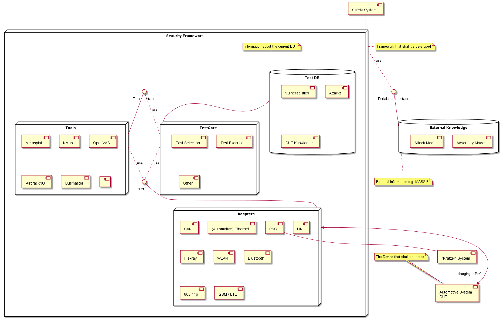
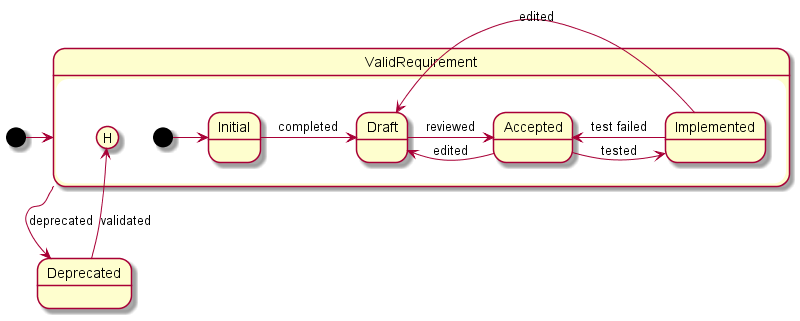

# HATS3 Security Framework Context & Customer Requirements

The requirements regarding the security testing framework shall be collected within the following document.

## Context of the Framework

The context of the framework is shown within the following diagram.

In this document (and the following ones) the definition of the component "Security Framework" is the target. This component will communicate with different other parts to perform security tests on automotive systems. These systems may be cars or partial systems of cars, like single ECUs. 

The main component will be the so called "Test Core", that has to be detailled further in the following steps. Within this block, the main goal of an automatization of the securtiy testing procedure will be implemented. To be able to do this, there has to be a kind of a database, that is storing current knowledge of the DUT as well as a centralized interface to communicate with the DUT. 
This interface is using different adapters, that allow communication with the DUT via different channels. The adapters themself will not be implemented as part of the framework but their common interface and therefore the communication between the framwork and the adapters has to be developed.

## Requirement Lifecycle

It is necessary for each requirement to meet the SMART guidelines in order to be accepted. As within this document the "customer requirements" are collected, not all requirements may fulfull the SMART guidelines. They will be further detailed in order to create "system and software requirements" as one of the next steps.

## Template

| Field | Content |
|---|---|
| **ID** | HATS3-Req- |
| **Name** |  |
| **Description** |  |
| **Source** | |
| **State** | Initial |
| **Notes** | |

## Detailed Description

### HATS3-Req-1 Security tests in standstill

| Field | Content |
|---|---|
| **ID** | HATS3-Req-1 |
| **Name** | Security tests in standstill |
| **Description** | Security Tests shall be able while the vehicle is in standstill |
| **Source** | Project Proposal 1.4 |
| **State** | Initial |
| **Notes** | Definition of "standstill" needed. What about the ignition? Is the vehicle locked? Is the infotainment system initially on and / or online? Is the telemetric unit online? Are there physical connections to the vehicle (e.g. OBD-II or PnC)?|

As the framework shall be able to perform a wide variety of security tests, there are no defined or fixed preconditions to start a test. A communiction to the vehicle must be able, but the channel for this communication may be part of the specific test setup. Therefore, the framework is independent of preconditions (e.g. if tests shall be performed by only using the cellular network connection but the vehcile (successfully) resists to connect to the framewok's radio terminal - that may be part of the test result).

Although this is no precondition, the framework must of course be able to access the vehicle in multiple ways. The exact definition of the communication channel's requirements will be described within the detailing of HATS3-Req-3.

### HATS3-Req-2 Security tests while driving

| Field | Content |
|---|---|
| **ID** | HATS3-Req-2 |
| **Name** | Security tests while driving |
| **Description** | Security tests shall be able while the vehicle is driving |
| **Source** | Project Propsal 1.4|
| **State** | Initial |
| **Notes** | The detailed definition of "drinving" has to be determined. Currently, the safety concept is designed to enable something like driving in walking speed while the tires are lifted. Any further requirements would cause an adaption of this concept. |

To be able to cover a possibly different communication characteristics while the vehicle is driving, tests under this condition shall be able as well. This may be limited by the safety concept as the safety of the laboratory as well as the DUT and the people has to be granted at all times.

Regarding the security framework itself there may be no additional system requirements. The only requirement may be the communication to the safety system to pause or abort a test if the system detects any potential unsafe state.

### HATS3-Req-3 Security tests on different architectures

| Field | Content |
|---|---|
| **ID** | HATS3-Req-3 |
| **Name** | Security tests on different architectures |
| **Description** | The framework has to be flexible to adapt to the vehicle's different architectures of their electrical system |
| **Source** | Project Proposal 1.4 |
| **State** | Initial |
| **Notes** | As statet in the project proposal, it is often suitable to compromise a single ECU as the bus system are not additionally secured. Nevertheless, as the bus architecture may vary from vehicle to vehicle, the framework has to be able to perform tests on multiple architectures, multiple bus technologies with different parameters and different target ECUs. |

This may be one of the biggest top level requirement for the testing framework as the different communication methods (protocols, access points etc.) a vehicle may have are connected to this. The design of this requirement is extremely important to provide a flexible and efficient way to add new methods for the communication.

### HATS3-Req-4 Aim different security mechanisms

| Field | Content |
|---|---|
| **ID** | HATS3-Req-4 |
| **Name** | Aim different security mechanisms |
| **Description** | The framework has to be able to aim at different target security mechanisms that may be implemented within the vehicle |
| **Source** | Project Proposal 1.4 |
| **State** | Initial |
| **Notes** | To secure a vehicle, different mechanisms and tactics (e.g. defense in depth, perimeter protection) are used. The framework has to be able to target these mechanisms. What mechanisms exectly has to be defined.  |

The protection methods used within the automotive industry may vary a lot. Threrfore, the ways of testing their effecitiveness must be very flexible as well. This causes the framework to be able to flexibly integrate and use new tools. 

### HATS3-Req-5 Security tests have to cooperate with the laboratory safety concept

| Field | Content |
|---|---|
| **ID** | HATS3-Req-5 |
| **Name** | Cooperation of the security framework with the safety concept of the laboratory |
| **Description** | As the security tests may have negative influence on the safety of the vehicle, the framework has to cooperate with the safety concept of the laboratory |
| **Source** | Project Proposal 1.4 |
| **State** | Initial |
| **Notes** | In case the framework is in use within the laboratory and safety relevant tests shall be performed (e.g. while vehicle is in "driving mode" (see HATS3-Req-2)) the safety concept of the laboratory has to be evaluated. In case the safe state can not be ensured (e.g. lifting platform is lowering), the securty tests have to be paused or aborted. |

In most of the cases, the tests may not influence any safety-critical functions in the vehicle. But as security weaknesses can possibly cause an safety-relevant issue, the safety of the people within the laboratory has to be evaluated. Therefore, the car will be located within a part of the laboratory that is monitored by a photoelectric barrier. In case this barrier detects someone or something that is near the vehicle, an acoustic and optic alarm will be triggered. Furthermore, the Security Test Framework will be informed over an ethernet connection. The same procedure will take place if other, for the safety relevant preconditions are not fulfilled, e.g. the electic power is no longer available or the lifting platform is lowering.

### HATS3-Req-6 Security tests via the charging station

| Field | Content |
|---|---|
| **ID** | HATS3-Req-6 |
| **Name** | Security tests via the charging station |
| **Description** | As modern vehicles are oft equiped with batteries that can be charged using a charging station, the communication with this statation as well as the charging parameters itself can be seen a an attack point. |
| **Source** | Project Proposal 1.4 |
| **State** | Initial |
| **Notes** | As the vehicle is communicating with the charging station to exchange information like capabilities, limits or even payment details, this communication can be a possible access point for attacks. Particulary the often unsupervised charging stations may be manipulated easily. Next to the communication the charging process itself may be attacked (e.g. by delivering a higher voltage than requested, different amperage and temparture behaviour). The security framework has to be able to perform these types of attacks.|

To do so, the already existing system ("Kratzer") shall be used. As this system only provides the electric energy, the communication has to be developed. For this purpose, a PNC (Plug-and-Chargr) evaluation bord will be ordered. 

### HATS3-Req-7 Early security tests of incomplete systems

| Field | Content |
|---|---|
| **ID** | HATS3-Req-7 |
| **Name** | Early security tests of incomplete systems |
| **Description** | The framework shall be able to perform tests on incomplete systems or even single components to be able to start the testing in an early development phase |
| **Source** | Project Proposal 1.4 |
| **State** | Initial |
| **Notes** | The definition of early as well as incomplete / partial systems have to be detailed to be able to evaluate the fulfillment of this requirement. |

To achieve this goal, mainly the hardware construction has to be flexible to connect single ECUs as well as whole vehicles. Additionally, the different communication technologies have to be implemented in ordner to communicate to the different ECUs.

### HATS3-Req-8 Automate security tests

| Field | Content |
|---|---|
| **ID** | HATS3-Req-8 |
| **Name** | Automation of security tests |
| **Description** | The framework shall be enabled to automate security tests |
| **Source** | Project Proposal 1.4 |
| **State** | Initial |
| **Notes** | To lower cost and effort of security tests, the necessary steps shall be automated as far as possible. Therefore, the framework shall be designed to enable this automation. Parts of the automation could be the information gathering, the decision, which access point shall be tested and whicht test shall be performed |

This is in some kind the key-feature of the whole framework. Next to the direct automation, technologies like a artificial intelligence penetration tester (AIPT :) ) shall be enabled. Other projects, like the modeling of attacks, adversary and target within MASSIV shall also be included (e.g. interfaces to this database, usage of the mechanisms to select the next step..)

### HATS3-Req-9 Integration of standard tools

| Field | Content |
|---|---|
| **ID** | HATS3-Req-9 |
| **Name** | Integration of standard tools |
| **Description** | The integrartion of standard tools for penetration tests shall be able. |
| **Source** | Project Proposal 1.4 |
| **State** | Initial |
| **Notes** | Standard tools for penetration tests in the IT can be used to test automotive / embedded systems or even systems of systems as well. Therefore, it shall be able to integrate these tools. In case the tools have to be asjusted for this purpose, this shall be concerned as well. |

A list of possibly useful tools can be found [here](tools/tools.md)

### HATS3-Req-10 Collection of data for automotive forensics and battery measurement

| Field | Content |
|---|---|
| **ID** | HATS3-Req-10 |
| **Name** | Collection of data for automotive forensics and battery measurment |
| **Description** | The security framework shall be used to collect information that is useful to study attacks on vehicles as well as to be able to estimate the state of battery systems. |
| **Source** | Project Proposal 1.4 |
| **State** | Initial |
| **Notes** | The framework shall be used to collect information that is not directly linked to the main goals of this project, but that can be useful to start further research on other topics, like the detection of manipulation, the evaluation of the battery's state for first- and second life and for topics in automotive forensics. The main requirement is to be able to be able to expand the framework for other types of research. |

### HATS3-Req-11 Visualization of the security testing process

| Field | Content |
|---|---|
| **ID** | HATS3-Req-11 |
| **Name** | Visualization of the security testing process |
| **Description** | The current state as well as the process of a security test shall be visualized in a simple way |
| **Source** | |
| **State** | Initial |
| **Notes** | To be able to show the results of the project even to non-securty experts, the security testing process shall be visualized in a simple way with a overview as well as the currently performed actions. Additionally, if further derails are needed, it has to be possible to show more details about the current state, e.g. logs.|
